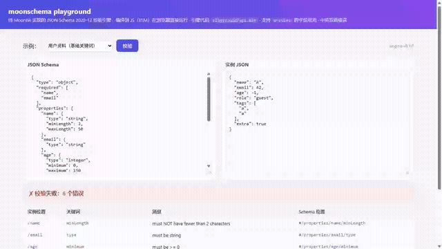

# moonschema

[](https://github.com/QuietlyChan/moonschema/actions/workflows/ci.yml)
[](https://quietlychan.github.io/moonschema/)
[](https://mooncakes.io/docs/#/QuietlyChan/moonschema/)
[](./LICENSE)

**▶ [在线 Playground](https://quietlychan.github.io/moonschema/)**：浏览器里实时编辑 Schema 与数据，即时看到带双路径的错误报告——无需安装，点开即玩。

**一个引擎、两种 API**：用纯 MoonBit 实现的 [JSON Schema 2020-12](https://json-schema.org/draft/2020-12) 校验引擎，同时提供 [ajv](https://ajv.js.org/) 风格的标准模式编译与 [zod](https://zod.dev/) 风格的流式构建器。编译到 **WASM-GC / JS / Native** 三目标，天然面向 Web 与服务端双场景。

> 本项目为 [2026 MoonBit 国产基础软件开源大赛](https://moonbitlang.github.io/OSC2026/) 参赛项目。



## 为什么是 moonschema

- **两层 API，一个引擎**：ajv 的 "编译 JSON Schema 文档 → 复用校验器" 适合前后端契约校验；zod 的 "字段默认必填 + 流式约束" 适合 MoonBit 业务代码内联建模。两者编译到同一份内部表示，语义完全一致。
- **跨字段动态规则 DSL**：`"end > start"`、`"items[0].price * items[0].qty == total"` 这类跨字段约束，表达式在**编译期**解析（语法错误即刻暴露），弥补声明式 JSON Schema 表达不了的表单级规则。
- **错误看得见、可中文化**：每条错误携带 `keyword`、`instance_path`（RFC 6901 JSON Pointer）、`schema_path` 三元组；校验消息内置中英双语（`locale=ZH` 一行切换）。
- **strict 模式**（ajv 同款默认行为）：拼错的关键词在**编译期**报错，而不是被静默忽略。
- **递归 `$ref` 可用**：树/链表等递归模式通过惰性解析 + 编译缓存支持。
- **纯 MoonBit、零第三方依赖**：仅依赖标准库 `moonbitlang/core`，天然跨 WASM-GC / JS / Native。

## 安装

```bash
moon add QuietlyChan/moonschema
```

## 快速开始

### ajv 风格：编译标准 JSON Schema

```moonbit
// moon.pkg: import "QuietlyChan/moonschema" @moonschema
let schema_text =
  #|{
  #|  "type": "object",
  #|  "required": ["id", "email"],
  #|  "properties": {
  #|    "id": { "type": "integer", "minimum": 1 },
  #|    "email": { "type": "string" }
  #|  },
  #|  "additionalProperties": false
  #|}
let v = @moonschema.compile(@moonschema.parse(schema_text))
let req =
  #|{ "id": -3, "email": 42, "extra": true }
let ok = v.check(@moonschema.parse(req)) // false
println(@moonschema.validate_to_string(v, @moonschema.parse(req)))
// /id: must be >= 1 [minimum @ #/properties/id/minimum]
// /email: must be string [type @ #/properties/email/type]
// (root): must NOT have additional properties ("extra") [additionalProperties @ #/additionalProperties]
```

可运行示例：`moon run cmd/demo`

### zod 风格：流式构建器

```moonbit
// moon.pkg: import "QuietlyChan/moonschema/builder" @builder
let user = @builder.object({
  "name": @builder.string().min_len(1).max_len(50),   // 默认必填，与 zod 一致
  "age": @builder.integer().min(0).max(150).optional(),
  "email": @builder.string().email(),                 // builder 层默认断言 format
}).strict()                                           // 拒绝未声明字段

let v = user.compile()        // moonschema 校验器
let doc = user.to_schema()    // 标准 JSON Schema 2020-12 文档，可与任何语言互通
```

### 校验结果的三种消费方式

```moonbit
let ok : Bool = v.check(instance)                      // 只要结论
let errors : Array[@moonschema.ValidationError] = v.validate(instance)
for e in errors {
  println("\{e.instance_path}: \{e.message}")          // 结构化消费
}
```

## 在浏览器中使用（Playground）

Playground 将引擎编译为 JS（ESM）模块在浏览器直接运行：

```bash
bash playground/build.sh        # moon build --target js --release --strip + 拷贝产物
cd playground/web && python -m http.server 8080   # 或 npx serve .
# 打开 http://localhost:8080
```

页面提供三个可编辑预设（基础关键词 / `x-rules` 跨字段规则 / `$ref` 递归），实时校验并以表格展示 `instance_path` / `schema_path` 双路径错误。已在 Chromium 实测。

宿主侧集成 API（`playground/api.mbt`，经 `moon.pkg` 的 `link: { js: { exports: [...] } }` 导出）：

| 导出函数 | 用途 |
|---|---|
| `validate_json(schemaText, dataText)` | 一次调用完成解析→编译→校验，返回结构化 JSON 结果 |
| `compile_schema(schemaText) -> handle` | ajv 式编译一次（句柄，失败 -1） |
| `check_with(handle, dataText) -> bool` | 热路径布尔判定 |
| `validate_with(handle, dataText) -> string` | 校验并返回完整错误 JSON |

> 关于 wasm-gc：引擎已验证可在 wasm-gc 目标编译并导出数值函数（`link.wasm-gc.exports`，Node 24 `WebAssembly.instantiate` 实测通过）；但字符串在 wasm-gc 边界是 GC 对象，对 JS 不透明，需 JS-string-builtins 方案——Playground 因此选择字符串原生互通的 JS 后端。

## 基准测试（vs ajv / zod）

Node 24，订单式嵌套 schema，每轮 5000 实例 × 7 轮取最优（`cd benchmark && npm i && node bench.mjs` 复现，详见 [benchmark/RESULTS.md](benchmark/RESULTS.md)）：

| 实现 / 工作负载 | ops/s | µs per validate |
|---|---|---|
| ajv valid (预解析对象) | 3,066,168 | 0.33 |
| zod valid (预解析对象) | 456,988 | 2.19 |
| ajv valid (+JSON.parse) | 400,898 | 2.49 |
| moonschema valid (字符串入口) | 89,177 | 11.21 |
| zod invalid (预解析对象) | 155,439 | 6.43 |
| moonschema invalid (字符串+错误报告) | 61,078 | 16.37 |

**编译期一次性成本**：moonschema `compile_schema` **6.4ms** vs ajv `compile` 49.9ms——**快约 8 倍**（树编译 vs 代码生成）。吞吐方面 ajv 的代码生成在 V8 上仍是天花板；moonschema 当前为树解释式执行，字符串入口口径与 zod+parse 同量级，优化空间见路线图。

## 性质测试（roundtrip）

`builder/roundtrip_wbtest.mbt`：种子化 LCG 生成 1100 个随机 JSON 实例（覆盖全部类型与嵌套），验证三条性质——`to_schema()` 文档序列化往返后判定一致、重复编译判定确定、`check`（fast path）与 `validate`（错误收集）互恰。

## 已支持的关键词

| 类别 | 关键词 |
|---|---|
| 核心 | `type`（含数组形式）、`enum`、`const`、`$ref`（本地 JSON Pointer，支持递归）、`$defs`、布尔模式 `true`/`false` |
| 数值 | `minimum`、`maximum`、`exclusiveMinimum`、`exclusiveMaximum`、`multipleOf`（浮点容差判定） |
| 字符串 | `minLength`、`maxLength`（按 Unicode 码点计数）、`pattern`（基于 core 正则引擎）、`format`（默认 annotation；`assert_format` 开启后断言 email / uuid / ipv4） |
| 数组 | `items`、`prefixItems`、`minItems`、`maxItems`、`uniqueItems`、`contains`、`minContains`、`maxContains` |
| 对象 | `properties`、`patternProperties`、`required`、`additionalProperties`、`propertyNames`、`minProperties`、`maxProperties`、`dependentRequired`、`dependentSchemas` |
| 组合 | `allOf`、`anyOf`、`oneOf`、`not`、`if`/`then`/`else` |
| 扩展 | `x-rules`：跨字段动态规则 DSL（见下节） |
| 编译选项 | `strict`（未知关键词报错，`x-` 前缀扩展放行）、`assert_format`、`locale`（错误消息 EN/ZH） |

**暂不支持**（编译期明确报错而非静默跳过）：远程 `$ref`（http/https）、命名 fragment 引用（`$anchor` / `$dynamicRef`）、子模式中的 `$id`（base URI 变更）、`unevaluatedProperties` / `unevaluatedItems`。draft-07 的 `items` 数组形式会给出迁移到 `prefixItems` 的提示。

注：`multipleOf` 使用浮点商的相对容差判定，`0.0075 % 0.0001` 这类十进制直觉场景不会因 IEEE 754 精度噪声误判。

## 跨字段规则 DSL（`x-rules`）

声明式 JSON Schema 表达不了 "结束日期晚于开始日期" 这类表单级约束，moonschema 用一条表达式 DSL 补齐：

```moonbit
// builder 侧
let order = @builder.object({
  "start": @builder.string(),
  "end":   @builder.string(),
  "total": @builder.number(),
  "items": @builder.array(@builder.object({
    "price": @builder.number(), "qty": @builder.number(),
  }).optional()),
}).satisfy("end > start")
  .satisfy("items[0].price * items[0].qty == total")

// JSON Schema 侧等价写法
// { "x-rules": ["end > start", "items[0].price * items[0].qty == total"] }
```

| 类别 | 运算符 |
|---|---|
| 比较 | `==` `!=` `<` `<=` `>` `>=`（数值按大小、字符串按字典序——ISO 日期可直接比较；跨类型为假） |
| 算术 | `+` `-` `*` `/` `%`（除零等产生非有限值时规则不可满足） |
| 逻辑 | `&&` `\|\|` `!`（短路） |
| 字面量 | 数字、字符串（`"..."`）、`true` / `false` / `null` |
| 路径 | 字段名、点号嵌套（`address.city`）、数组下标（`items[0].price`） |

语义要点：

- **缺失即藐视通过**：表达式引用的路径全部存在才参与判定——可选项的成对约束只约束"存在"的场合，是否必填仍由默认必填 / `.optional()` / `required` 表达
- **编译期语法检查**：规则在 `compile()` 时解析，拼写错误立刻暴露，而不是等到校验期静默失效
- 错误的 `schema_path` 精确到 `#/x-rules/<序号>`

## 错误消息 i18n

```moonbit
// JSON Schema 侧
let v = compile(schema, options=CompileOptions::new(locale=ZH))
// builder 侧
let v = user.compile(locale=ZH)
```

```text
(root): 缺少必需属性 "name" [required @ #/required]
/age: 必须 >= 0 [minimum @ #/properties/age/minimum]
(root): 规则 "age > 0" 未满足 [x-rules @ #/x-rules/1]
```

默认英文；`Locale::EN` / `Locale::ZH` 内置，消息本地化只影响校验结果（模式编译错误面向开发者，始终英文）。

## 官方一致性测试

内置 [JSON-Schema-Test-Suite](https://github.com/json-schema-org/JSON-Schema-Test-Suite) draft2020-12 全量测试（`cmd/conformance/suite_data.mbt`，由脚本生成），运行 `moon run cmd/conformance`：

```
groups: 384 (compile-rejected: 133)
pass: 974  fail: 1  skip: 326
pass rate (of judged 975): 99.90%
```

- **skip (326)**：模式使用了引擎暂不支持的关键词（`unevaluated*`、`$dynamicRef`、远程引用等），strict 模式编译期整组拒绝，透明计入而非伪装成失败
- **fail (1)**：自定义元场景表（vocabulary）语义——v0 不做元模式感知，属已知边界

## 与 ajv / zod 的 API 对应

| moonschema | ajv | zod |
|---|---|---|
| `compile(schemaDoc)` | `ajv.compile(schema)` | — |
| `v.validate(x)` + errors 数组 | `validate(x)` + `ajv.errors` | `schema.safeParse(x)` |
| `v.check(x)` | `validate(x)` 返回值 | `schema.check(x)` |
| `@builder.object({...})` | — | `z.object({...})` |
| `.optional()` / `.nullable()` | — | `.optional()` / `.nullable()` |
| `.strict()` / `.catchall(s)` | `additionalProperties: false` | `.strict()` / `.catchall()` |
| `.enum_(vals)` / `.literal(v)` | `enum` / `const` | `z.enum` / `z.literal` |
| `.email()` / `.uuid()` / `.ipv4()` | `format: "email"` + ajv-formats | `.email()` / `.uuid()` |

## 关于 WASM 性能

MoonBit 的首选目标 WASM-GC 让本库可以被 JS 前端以近原生速度调用（无 JIT 预热、内存布局紧凑、校验热路径为纯计算）。roadmap 中把**对 ajv / zod 的基准测试**作为一等交付物：同一组 schema + 数据集，在 JS 后端与 WASM-GC 后端分别跑分，用数据说话。测试套件已在 native 与 wasm-gc 双目标下全部通过。

## 开发

```bash
moon check                  # 静态检查
moon test                   # 运行测试（native）
moon test --target wasm-gc  # 运行测试（WASM-GC）
moon run cmd/demo           # 可运行示例
moon fmt && moon info       # 格式化 + 更新包接口
```

## 路线图

- [x] **W1** 引擎核心：编译器 + 校验器 + 错误模型 + `$ref` 惰性解析（双目标测试通过）
- [x] **W2** 官方 JSON-Schema-Test-Suite 接入与跑分（**974/975 判定通过，99.90%**）；`pattern` / `patternProperties`（基于 core 正则引擎）；整数解析溢出修复（core 上游 bug workaround）
- [x] **W3** 跨字段动态规则 DSL（`x-rules` + builder `.satisfy()`，编译期语法检查）；错误消息 i18n（中/英）；quickcheck 式 roundtrip 性质测试（种子化随机实例 ×1100）
- [x] **W4** Node 基准测试报告（vs ajv/zod，编译期快 8×）；浏览器 Playground（JS 后端 ESM 导出，含宿主集成 API）
- [ ] **后续** wasm-gc 字符串边界（JS-string-builtins）；校验吞吐优化（错误结构/查找路径）；mooncakes 发布

## License

[Apache-2.0](./LICENSE)

## 附：wasm-gc 字符串边界协议（已验证）

wasm-gc 的 `String` 编译为自定义 GC 结构，对 JS 不透明；`extern "js"` 在该后端不受支持。跨边界传输文本的可行方案是**字节块协议**（`playground/wasm-gc-spike/` 内含端到端验证代码，支持中文/emoji 多字节）：

1. JS `TextEncoder` → UTF-8 字节 → 按 8 字节打包 `i64` 分次写入 wasm 侧缓冲
2. `commit(len)` 触发 wasm 侧 `@encoding/utf8` 解码与校验，结果写回输出缓冲
3. JS 分块读回 → `TextDecoder` 解码

三条硬教训：导出函数**禁止 `raise`**（签名会变成不透明的 GC Result 对象）；`--output-wat` 与 `.wasm` 产物可能失同步；导出配置变更后需完整重建。
